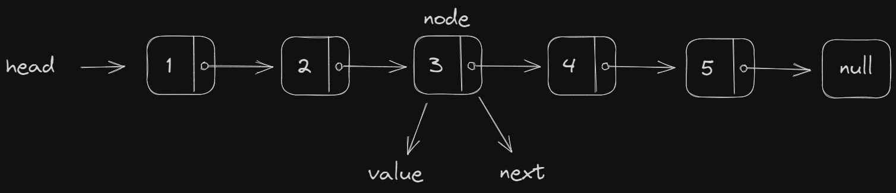

# Reverse Linked List

## Linked List Structure



## Impure Iterative

To use as little memory as possible, we can make our changes directly to the input instead of creating a new list.

Time complexity is `O(n)` (where `n` is the size of the original list) because it iterates exactly once per node in the original list.

The space complexity is `O(1)` because it doesn't create any new objects and doesn't call any functions.

## Pure Iterative
We can keep the original list in-tact at the cost of a linear complexity.

Time complexity is `O(n)` (where `n` is the size of the original list) because it iterates exactly once per node in the original list.

The space complexity is `O(n)` because it creates a new node (new object) for each node found in the original list.

## Mock Case
```javascript 
const head = {
  val: 1,
  next: {
    val: 2,
    next: {
      val: 3,
      next: {
        val: 4,
        next: {
          val: 5,
          next: null,
        },
      },
    },
  },
};

const reverseList = {
  val: 5,
  next: {
    val: 4,
    next: {
      val: 3,
      next: {
        val: 2,
        next: {
          val: 1,
          next: null,
        },
      },
    },
  },
};
```  

## Conclusion
In most case, the pure iterative algorithm is preferred as it provides the best real-world performance (no bloated call stacks) while keeping the function pure.

Pure functions are preferred in many cases, especially when there way be multiple algorithms running in parallel on the same list.

In non-concurrency case, the impure iterative algorithm is preferred as it provides the best time and space complexity in the tight case.
