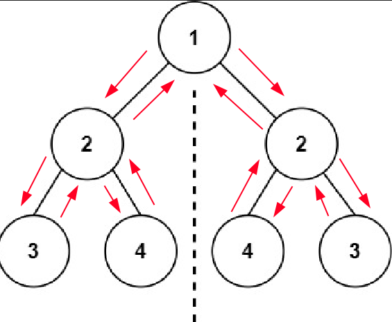
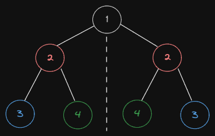

# Symmetric Solution - Recursive Solution

## Big O Notation

This solution uses recursion to check if a binary tree is symmetric. The recursive helper function `isMirror()` checks if the two nodes of the binary tree are mirror images, by comparing their values, and then recursively checking if their left and right nodes are mirror images.

The `time complexity` is `O(n)` because all nodes must be visited in order to determine if the tree is symmetric.

The `space complexity` is `O(n)` as the `recursive stack` may contain up to `n` elements.

## Mock Structure

```typescript
TreeNode {
  val: 1,
  left: TreeNode {
    val: 2,
    left: TreeNode { val: 3, left: null, right: null },
    right: TreeNode { val: 4, left: null, right: null }
  },
  right: TreeNode {
    val: 2,
    left: TreeNode { val: 4, left: null, right: null },
    right: TreeNode { val: 3, left: null, right: null }
  }
}
``` 

## Algorithm Workflow



## Compare Left vs Right Sides




