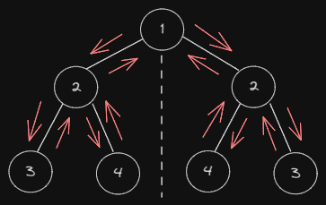

# Symmetric Solution

## Mock Structure

```typescript
TreeNode {
  val: 1,
  left: TreeNode {
    val: 2,
    left: TreeNode { val: 3, left: null, right: null },
    right: TreeNode { val: 4, left: null, right: null }
  },
  right: TreeNode {
    val: 2,
    left: TreeNode { val: 4, left: null, right: null },
    right: TreeNode { val: 3, left: null, right: null }
  }
}
``` 

## Algorithm Workflow



## Compare Left vs Right Sides


